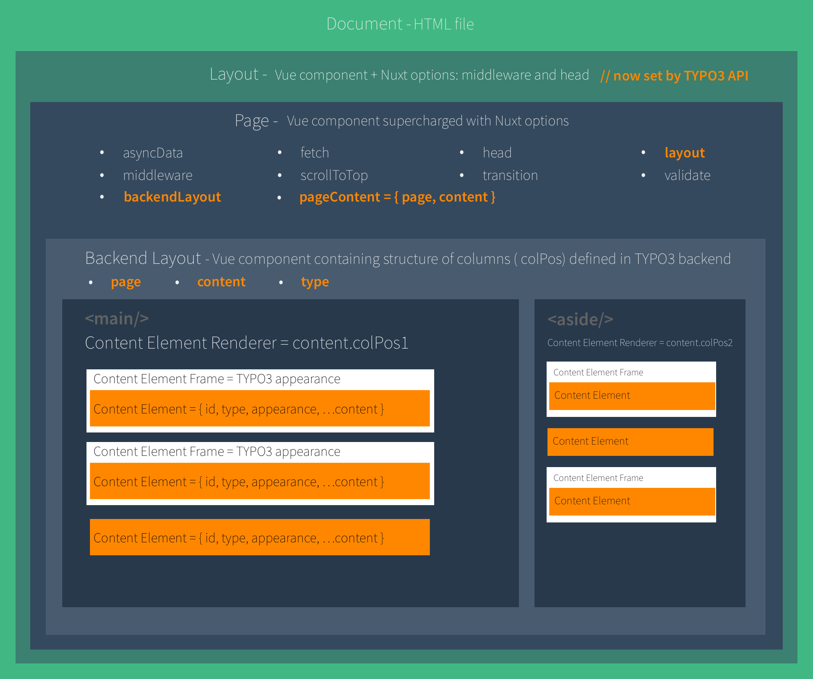

<p align="center">
  
</p>
<p align="center">
  <a href="https://npmjs.com/package/nuxt-typo3"></a>
  <a href="https://npmjs.com/package/nuxt-typo3"></a>
  <a href="https://standardjs.com"></a>
  <a href="https://www.npmjs.com/package/nuxt-typo3"></a>
</p>

#### TYPO3 module for [Nuxt.js](https://nuxtjs.org) and [TYPO3 headless](https://github.com/TYPO3-Initiatives/headless) provides API handling and frontend rendering.  

# Features

✅ Handle dynamic API routes

✅ Frontend layouts

✅ Backend layouts

✅ Multilanguage

✅ Meta tags provided by API

✅ Most of the standard TYPO3 Content Elements (in progress)

✅ SSR Ready

# Setup

We're working on documentation/guide, but you can use it right now.

## Installation 

Install with yarn 

```sh
yarn add nuxt-typo3
```

Install with npm

```sh
npm install nuxt-typo3
```

## Configuration

1. Add ```typo3``` object to your nuxt.config.js to configure all required settings. 

```js
{
  modules: [
    'nuxt-typo3',
  ],

  typo3: {
    baseURL: 'https://yourwebsite.com',
    api: {
      baseURL: 'https://api.yourwebsite.com'
    },
    i18n: {
      locale: 'en',
      fallbackLocale: 'en'
    }
  }
}
```

2. `nuxt-typo3` require [Vuex](https://vuex.vuejs.org/) store. Create empty index.js file in store directory, read more [here](https://nuxtjs.org/guide/vuex-store).

3. remove `index.vue` from pages directory - now your pages provides TYPO3 API

## Frontend rendering

1. To handle dynamic routes provided by API we use [Unknown Dynamic Nested Routes Pattern](https://nuxtjs.org/guide/routing#unknown-dynamic-nested-routes). We provided router middleware which makes calls to API and provide data as asyncData. 
2. To handle frontend layouts defined in TYPO3 backend (page->appearance) we use [Nuxt.js Layouts](https://nuxtjs.org/guide/views#layouts)
3. We provide additional support for backend layouts defined in TYPO3 backend. Information about selected layout is returned by API to asyncData. 
4. To render content elements we prepared [render component](lib/templates/components/content/CeRenderer.js) which renders dynamic content elements based on type (returned by API)

This is the [Nuxt.js diagram describes view rendering](https://nuxtjs.org/guide/views) filled by nuxt-typo3 components:



## Content elements

### Base content element

📍 Each content element contains base and common props shipped by API. 

📍 Each content element has `Ce` prefix ( We would like to avoid conflicts with other libraries or with your UI components )


Base props are used by [render components](lib/templates/components/content/CeDynamic.js): 

```js
 props: {
    ...{
      id: this.data.uid,
      type: this.data.type,
      appearance: this.data.appearance
    },
    ...this.data.content
 }
```

📍 ```this.data.content``` contains all custom props shipped by API

📍 Common props are related mainly with header, check [shareProps](lib/templates/components/mixins/../content/mixins/shareProps.js)

### Create own content element 

1. Create component, you can use [base content element](lib/templates/components/content/mixins/baseCe.js) mixin to inherit all common props. 

`CeText.vue`:

```html
<template>
  <div>
    <strong> Hello {{ header }} </strong>
  </div>
</template>
<script>
import baseCe from '~typo3/components/content/elements/baseCe'
export default {
  name: 'CeText',
  extends: baseCe
}
</script>
```

2. Register your content elements as [plugin for Nuxt](https://nuxtjs.org/guide/plugins/). Create `components.js` in `/plugins/` directory   

`components.js`:
   
```js
import Vue from 'vue'
import CeText from '~/components/content/elements/CeText'

const components = {
  CeText
}

export default ({ app }) => {
  Object.keys(components).forEach(key => {
    Vue.component(key, components[key])
  })
}
```

3. Setup nuxt configuration

```js
export default {
  plugins: ['~/plugins/components']
}
```


To render this content element your API should returns content element with type `text`

## Layouts

Soon

## Development

1. Clone this repository
2. Install dependencies using `yarn install` or `npm install`
3. Start development server using `npm run dev`

## License

[MIT License](./LICENSE)

Copyright (c) MACOPEDIA
